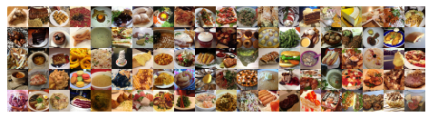

<H1 align="center">FoodVision</H1>

The Purpose of this notebook is to classify images of food into 101 categories

The paper we will follow is [Food-101 – Mining Discriminative Components with Random Forests](https://data.vision.ee.ethz.ch/cvl/datasets_extra/food-101/static/bossard_eccv14_food-101.pdf)

This notebook ws inspired from [Daniel Bourke's version](https://github.com/mrdbourke/tensorflow-deep-learning/blob/main/07_food_vision_milestone_project_1.ipynb)

## Sample images

## Building a feature extraction model using EffiecentNet and fine-tuning it

1. We will be developing our model in TensorFlow.
1. The first layer will be a pretrained EfficientNet with all the layers frozen.
2. This is followed by a softmax with 101 classes/
3. After training the model we will unfreeze the last 5 layers of the EfficientNet layer and train it again.

## Acknowledgements
* [Food-101 – Mining Discriminative Components with Random Forests](https://data.vision.ee.ethz.ch/cvl/datasets_extra/food-101/static/bossard_eccv14_food-101.pdf)
* [Daniel Bourke's version](https://github.com/mrdbourke/tensorflow-deep-learning/blob/main/07_food_vision_milestone_project_1.ipynb)
